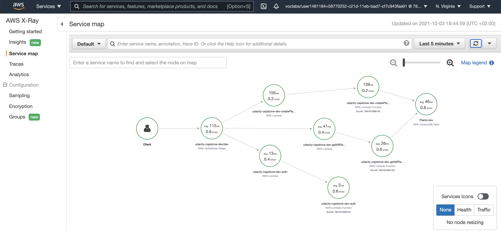

# Capstone Project for Udacity

## Garden Application

Simple API that allow the user to create and retrieve plants information. 

For testing the postman collection an be used to interact with the:
- create
- retrieve
APIs. 

I copied over from the previous project the client that can be used for getting the auth token (but not for interacting with the app, since the frontend is not deeded)

X-Ray tracing is enabled and working. 

## Evidences

Demo of the interaction with the APIs.

X-Ray tracing enabled.
